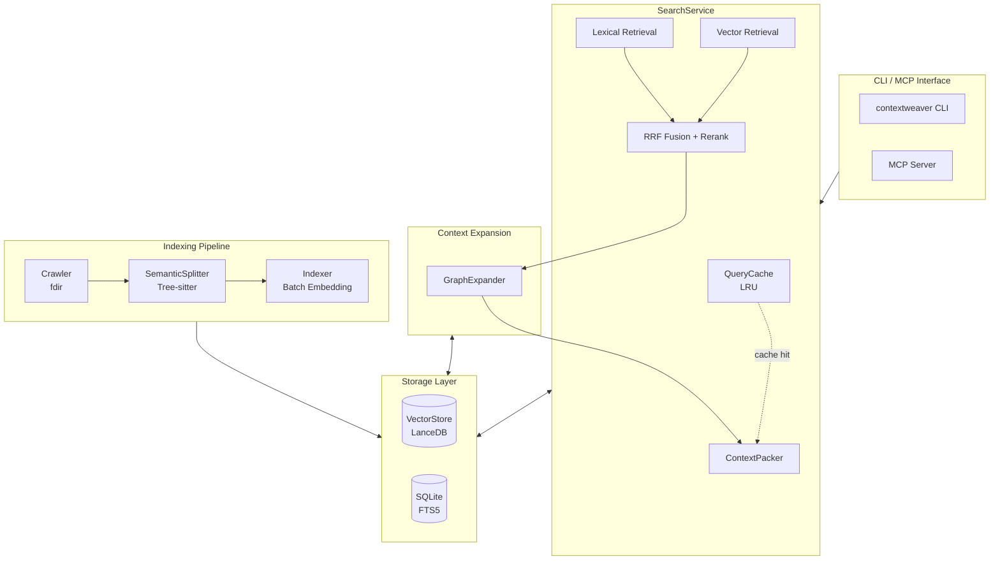

# ContextWeaver

<p align="center">
  <strong>🧵 A codebase context engine woven for AI agents</strong>
</p>

<p align="center">
  <em>Semantic Code Retrieval for AI Agents — Hybrid Search • Graph Expansion • Token-Aware Packing</em>
</p>

<p align="center">
  <strong>English</strong> ·
  <a href="README.zh-CN.md">简体中文</a>
</p>

---

**ContextWeaver** is a semantic retrieval engine purpose-built for AI coding assistants. It combines hybrid search (vector + lexical), intelligent context expansion, and token-aware packing to deliver precise, relevant, and context-complete code snippets to LLMs.

<p align="center">
  
</p>

## ✨ Core Features

### 🔍 Hybrid Retrieval Engine
- **Vector Retrieval**: deep semantic understanding via similarity
- **Lexical Retrieval (FTS)**: exact matching for function names, class names, and other technical terms
- **RRF Fusion (Reciprocal Rank Fusion)**: intelligently merges multiple recall channels

### 🧠 AST Semantic Chunking
- **Tree-sitter parsing**: supports TypeScript, JavaScript, Python, Go, Java, Rust, C, C++, C#, and more
- **Dual-Text strategy**: `displayCode` for presentation, `vectorText` for embedding
- **Gap-Aware merging**: handles code gaps intelligently while preserving semantic integrity
- **Breadcrumb injection**: vector text carries hierarchical paths to boost recall
- **UTF-16 character-domain normalization**: offsets are unified via `SourceAdapter.toCharOffset` before writing metadata, preventing multi-byte character slicing errors (v1.4.0+)

### 📊 Three-Stage Context Expansion
- **E1 Neighbor expansion**: adjacent chunks within the same file, preserving block completeness
- **E2 Breadcrumb completion**: sibling methods under the same class/function for structural understanding
- **E3 Import resolution**: cross-file dependency tracking (configurable toggle)

### 🎯 Smart TopK Cutoff
- **Anchor & Floor**: dynamic threshold plus an absolute floor as dual safeguards
- **Delta Guard**: prevents misjudgment in Top1-outlier scenarios
- **Safe Harbor**: the first N results only check the floor, guaranteeing baseline recall

### 🔌 Native MCP Support
- **MCP Server mode**: launch a Model Context Protocol server with one command
- **Multi-tool granularity** (v1.5.0+): beyond core semantic retrieval, adds dedicated tools for structure browsing, symbol references, symbol definitions, and statistics
- **Intent/term separation**: an LLM-friendly API design
- **Auto-indexing**: the first query triggers indexing automatically; incremental updates are transparent

### ⚡ Query Cache & File Watching (v1.5.0+)
- **Query cache (QueryCache)**: in-process per-project LRU cache (50 entries by default); a hit skips the entire vector recall / rerank / expansion pipeline
- **Automatic cache invalidation**: the cache key is composed of `normalized query + projectId + index version + search-config fingerprint`, so it invalidates automatically after an index update or config change — stale results are never returned
- **Watch mode**: `contextweaver watch` watches the filesystem and triggers incremental indexing automatically, with debouncing (500ms by default) and scan de-duplication (no concurrent scans)

### 📈 Statistics & Observability (v1.5.0+)
- **Three metric groups**: indexing process, search quality/behavior, health/consistency
- **Dual exits**: `contextweaver stats` CLI (with `--json`) plus the MCP `stats` tool
- **Consistency diagnostics**: automatically detects abnormal migration state, `pending_marks` backlog, missing vector rows, and more — with suggested fixes

### 🛡️ Crash-Safe Data Architecture (v1.4.0+)
- **Single source of truth for content**: LanceDB stores only vectors and locating metadata; content is read back from `files.content`, reducing index size by 30–50%
- **Cross-store transactional compensation**: three-stage write LanceDB → FTS+outbox → SQLite mark, with automatic rollback or replay on any failure
- **Migration state machine**: `pending/done/aborted` persisted, auto-rebuilt on crash recovery
- **Cross-process mutual exclusion**: an advisory lock prevents the MCP server and CLI from triggering LanceDB migration concurrently
- **chunk_id de-duplication**: pre-delete before write to avoid duplicate rows on retry

## 📦 Quick Start

### Requirements

- Node.js >= 20
- pnpm (recommended) or npm

### Installation

```bash
# Global install
npm install -g @chiway/contextweaver

# Or with pnpm
pnpm add -g @chiway/contextweaver
```

### Initialize Configuration

```bash
# Create the config file (~/.contextweaver/.env)
contextweaver init
# Or the short alias
cw init
```

Edit `~/.contextweaver/.env` and fill in your API keys:

```bash
# Embedding API config (required)
EMBEDDINGS_API_KEY=your-api-key-here
EMBEDDINGS_BASE_URL=https://api.siliconflow.cn/v1/embeddings
EMBEDDINGS_MODEL=BAAI/bge-m3
EMBEDDINGS_MAX_CONCURRENCY=10
EMBEDDINGS_DIMENSIONS=1024

# Reranker config (required)
RERANK_API_KEY=your-api-key-here
RERANK_BASE_URL=https://api.siliconflow.cn/v1/rerank
RERANK_MODEL=BAAI/bge-reranker-v2-m3
RERANK_TOP_N=20

# Search parameters (optional, override built-in defaults)
CW_SEARCH_WVEC=0.6
CW_SEARCH_WLEX=0.4
CW_SEARCH_RERANK_TOP_N=10
CW_SEARCH_MAX_TOTAL_CHARS=48000
CW_SEARCH_VECTOR_TOP_K=80
CW_SEARCH_SMART_MAX_K=8
CW_SEARCH_IMPORT_FILES_PER_SEED=3

# Ignore patterns (optional, comma-separated)
# IGNORE_PATTERNS=.venv,node_modules
```

### Index a Codebase

```bash
# Run from the codebase root
contextweaver index

# Specify a path
contextweaver index /path/to/your/project

# Force a full re-index
contextweaver index --force
```

### Watch Mode (v1.5.0+)

```bash
# Watch for file changes and auto-index incrementally (Ctrl+C to stop)
contextweaver watch

# Specify a path and debounce window (ms)
contextweaver watch /path/to/project --debounce 800
```

`watch` runs one full incremental scan on startup, then listens to filesystem events; changes trigger a de-duplicated scan within the debounce window, and paths excluded by ignore rules never trigger a scan.

### Local Search

```bash
# Semantic search
cw search --information-request "How is the user authentication flow implemented?"

# With exact terms
cw search --information-request "Database connection logic" --technical-terms "DatabasePool,Connection"
```

### Structure Browsing & Symbol Lookup (v1.5.0+)

The following commands are CLI mirrors of MCP tools, with zero Embedding API cost:

```bash
# List indexed files (supports glob / language / count filters)
contextweaver list-files --glob "src/**/*.ts" --language typescript --max-results 100

# Look up a symbol definition
contextweaver definition SearchService --hint-path src/search

# Look up symbol references
contextweaver references handleStats --exclude-definition
```

### Statistics (v1.5.0+)

```bash
# Human-readable stats report
contextweaver stats

# JSON output (for scripting)
contextweaver stats --json

# Specify a project path
contextweaver stats --path /path/to/project
```

### Start the MCP Server

```bash
# Launch the MCP server (for use by Claude and other AI assistants)
contextweaver mcp
```

### Index Management (v1.4.0+)

```bash
# Show LanceDB migration state
contextweaver migrate

# Clear the aborted state: wipe LanceDB and trigger a full rebuild
# Triggered when: the Indexer refuses to write after sampling validation fails;
# run this, then index again.
contextweaver migrate --reset

# Specify a project path
contextweaver migrate --path /path/to/project
```

## 🔧 MCP Integration

### Claude Desktop Configuration

Add the following to your Claude Desktop config file:

```json
{
  "mcpServers": {
    "contextweaver": {
      "command": "contextweaver",
      "args": ["mcp"]
    }
  }
}
```

### MCP Tools Overview (v1.5.0+)

ContextWeaver exposes 5 MCP tools, following a layered design of "semantic retrieval first, structure browsing second":

| Tool | Purpose | Embedding cost |
|------|---------|----------------|
| `codebase-retrieval` | **Primary tool**: hybrid semantic + exact-match retrieval | Yes |
| `list-files` | List indexed file structure (path/language/size) | No |
| `find-references` | Find heuristic text references to a symbol | No |
| `get-symbol-definition` | Find likely definition blocks for a symbol | No |
| `stats` | Index/search/health statistics | No |

#### `codebase-retrieval` Parameters

| Parameter | Type | Required | Description |
|-----------|------|----------|-------------|
| `repo_path` | string | ✅ | Absolute path to the repository root |
| `information_request` | string | ✅ | The semantic intent in natural language |
| `technical_terms` | string[] | ❌ | Exact technical terms (class/function names, etc.) |

#### `list-files` Parameters

| Parameter | Type | Required | Description |
|-----------|------|----------|-------------|
| `repo_path` | string | ✅ | Absolute path to the repository root |
| `glob` | string | ❌ | Glob pattern to filter paths |
| `language` | string | ❌ | Language filter (matched against `files.language`) |
| `max_results` | number | ❌ | Max files to return (default 200) |

#### `find-references` Parameters

| Parameter | Type | Required | Description |
|-----------|------|----------|-------------|
| `repo_path` | string | ✅ | Absolute path to the repository root |
| `symbol` | string | ✅ | Exact symbol name |
| `exclude_definition` | boolean | ❌ | Exclude chunks whose breadcrumb tail matches the symbol name |
| `max_results` | number | ❌ | Max references to return (default 50) |

#### `get-symbol-definition` Parameters

| Parameter | Type | Required | Description |
|-----------|------|----------|-------------|
| `repo_path` | string | ✅ | Absolute path to the repository root |
| `symbol` | string | ✅ | Exact symbol name to resolve |
| `hint_path` | string | ❌ | Preferred path to disambiguate same-name definitions |
| `max_results` | number | ❌ | Max definitions to return (default 3) |

> **Note**: `find-references` and `get-symbol-definition` are heuristic text lookups over indexed chunks, not compiler-accurate navigation. For exhaustive raw text matching, use `grep` outside MCP.

#### Design Philosophy

- **Intent/term separation**: `information_request` describes "what to do", `technical_terms` filters "what it's called"
- **Same-file context first**: same-file context is provided by default; cross-file exploration is initiated by the agent
- **Return to agent instincts**: the tool only locates; cross-file exploration is triggered by the agent on demand

## 🏗️ Architecture



### Core Modules

| Module | Responsibility |
|--------|----------------|
| **SearchService** | Hybrid search core: coordinates vector/lexical recall, RRF fusion, rerank; integrates QueryCache |
| **QueryCache** | Per-project in-process LRU cache (v1.5.0+); a hit skips the entire retrieval pipeline |
| **GraphExpander** | Context expander: runs the E1/E2/E3 three-stage expansion strategy |
| **ContextPacker** | Context packer: segment merging and token budget control |
| **ChunkContentLoader** | Slices `files.content` by `(path, start_index, end_index)` (v1.4.0+) |
| **VectorStore** | LanceDB adapter; exposes pure vector operations only |
| **Database (SQLite)** | Metadata storage + FTS5 full-text index + statistics counters, schema_version=3 |
| **Bootstrap** | Cross-store init coordinator: pending_marks replay + LanceDB schema migration (v1.4.0+) |
| **SemanticSplitter** | AST semantic chunker (Tree-sitter); normalizes offsets to the UTF-16 character domain on write |
| **Watcher** | File-watch coordinator (v1.5.0+): debounce + scan de-duplication + ignore filtering |
| **Stats** | Statistics aggregation layer (v1.5.0+): combines index/search/health metrics |

### Data Architecture (v1.4.0+)

```
~/.contextweaver/<projectId>/
├── index.db                 # SQLite
│   ├── files                # File metadata + full content (content column, the only source for text slicing)
│   ├── files_fts            # External-content table, inverted index pointing to files
│   ├── chunks_fts           # Chunk-level inverted index, per-file wholesale replacement
│   ├── metadata             # schema_version / lancedb_migration_state / lock
│   ├── stats                # Cumulative index/search counters (v1.5.0+)
│   └── pending_marks        # Outbox: replayed when a vector_index_hash mark failed
└── vectors.lance/           # LanceDB chunks table (vectors + locating metadata only, no content)
```

**Key invariants**:
- The single source of truth for content is `files.content`; `ChunkContentLoader` slices via `start_index/end_index` (same source as `displayCode`)
- All LanceDB offset fields live in the UTF-16 character domain; multi-byte files are never sliced incorrectly
- Cross-store write order: LanceDB → (FTS + outbox single transaction) → SQLite mark + clear outbox
- LanceDB migration state `pending/done/aborted` is persisted, with cross-process mutual exclusion via an advisory lock
- The query cache key is bound to the index version and search-config fingerprint; it invalidates on any index or config change

## 📁 Project Structure

```
contextweaver/
├── src/
│   ├── index.ts              # CLI entry (init / index / watch / search / mcp / migrate / stats)
│   ├── config.ts             # Config management (environment variables)
│   ├── defaultEnv.ts         # Default .env template
│   ├── cli/
│   │   └── mirrorCommands.ts # CLI mirrors of MCP tools (list-files / definition / references)
│   ├── api/                  # External API wrappers
│   │   ├── embedding.ts      # Embedding API
│   │   └── reranker.ts       # Reranker API
│   ├── chunking/             # Semantic chunking
│   │   ├── SemanticSplitter.ts   # AST semantic chunker
│   │   ├── SourceAdapter.ts      # Source adapter (UTF-16/UTF-8 domain normalization)
│   │   ├── LanguageSpec.ts       # Language spec definitions
│   │   ├── ParserPool.ts         # Tree-sitter parser pool
│   │   └── types.ts              # Chunking type definitions
│   ├── scanner/              # File scanning
│   │   ├── index.ts          # Scan orchestration
│   │   ├── crawler.ts        # Filesystem traversal
│   │   ├── processor.ts      # File processing
│   │   ├── watcher.ts        # File-watch coordinator (v1.5.0+)
│   │   ├── filter.ts         # Filter rules
│   │   ├── hash.ts           # File hash
│   │   └── language.ts       # Language detection
│   ├── indexer/              # Indexer
│   │   └── index.ts          # Three-stage transaction (LanceDB → FTS+outbox → SQLite mark)
│   ├── vectorStore/          # Vector storage
│   │   └── index.ts          # LanceDB adapter (pure vector operations)
│   ├── db/                   # Database
│   │   ├── index.ts          # SQLite + FTS5 + pending_marks + migration state machine + stats counters
│   │   └── bootstrap.ts      # Cross-store init coordinator (v1.4.0+)
│   ├── search/               # Search service
│   │   ├── SearchService.ts      # Core search service (cache-integrated)
│   │   ├── QueryCache.ts         # Per-project LRU query cache (v1.5.0+)
│   │   ├── GraphExpander.ts      # Context expander
│   │   ├── ContextPacker.ts      # Context packer
│   │   ├── ChunkContentLoader.ts # Slices by (path, start_index, end_index) (v1.4.0+)
│   │   ├── fts.ts                # Full-text search (per-file wholesale replacement)
│   │   ├── config.ts             # Search default config + value bounds
│   │   ├── loadConfig.ts         # Env-var overrides + config fingerprint (v1.5.0+)
│   │   ├── types.ts              # Type definitions
│   │   ├── utils.ts              # Token-overlap scoring
│   │   └── resolvers/            # Multi-language import resolvers
│   │       ├── JsTsResolver.ts
│   │       ├── PythonResolver.ts
│   │       ├── GoResolver.ts
│   │       ├── JavaResolver.ts
│   │       ├── RustResolver.ts
│   │       ├── CppResolver.ts
│   │       └── CSharpResolver.ts
│   ├── stats/                # Statistics aggregation layer (v1.5.0+)
│   │   └── index.ts          # Aggregates and renders index/search/health metrics
│   ├── mcp/                  # MCP server
│   │   ├── server.ts         # MCP server implementation (registers 5 tools)
│   │   ├── main.ts           # MCP entry
│   │   └── tools/
│   │       ├── index.ts                 # Tool registry
│   │       ├── shared.ts                # Shared tool logic
│   │       ├── codebaseRetrieval.ts     # Code retrieval tool
│   │       ├── listFiles.ts             # File structure browsing (v1.5.0+)
│   │       ├── findReferences.ts        # Symbol reference lookup (v1.5.0+)
│   │       ├── getSymbolDefinition.ts   # Symbol definition lookup (v1.5.0+)
│   │       └── stats.ts                 # Statistics tool (v1.5.0+)
│   └── utils/                # Utilities
│       ├── logger.ts         # Logging system
│       ├── encoding.ts       # Encoding detection
│       └── lock.ts           # File lock
├── tests/                    # Unit + integration tests (28 test files, 156 test cases)
│   ├── chunking/             # SourceAdapter / chunking
│   ├── cli/                  # mirrorCommands
│   ├── db/                   # migration, outbox, advisory lock, index-version
│   ├── indexer/              # transaction compensation, GC, aborted guard
│   ├── integration/          # real LanceDB end-to-end
│   ├── mcp/                  # list-files / find-references / get-symbol-definition / shared / tool registry
│   ├── scanner/              # watcher / index-version
│   ├── search/               # FTS, ChunkContentLoader, Packer, cache, loadConfig
│   ├── stats/                # statistics aggregation
│   └── vectorStore/          # chunk_id de-duplication, sampling validation
├── package.json
└── tsconfig.json
```

## ⚙️ Configuration Reference

### Environment Variables

| Variable | Required | Default | Description |
|----------|----------|---------|-------------|
| `EMBEDDINGS_API_KEY` | ✅ | - | Embedding API key |
| `EMBEDDINGS_BASE_URL` | ✅ | - | Embedding API URL |
| `EMBEDDINGS_MODEL` | ✅ | - | Embedding model name |
| `EMBEDDINGS_MAX_CONCURRENCY` | ❌ | 10 | Embedding concurrency |
| `EMBEDDINGS_DIMENSIONS` | ❌ | 1024 | Vector dimensions |
| `RERANK_API_KEY` | ✅ | - | Reranker API key |
| `RERANK_BASE_URL` | ✅ | - | Reranker API URL |
| `RERANK_MODEL` | ✅ | - | Reranker model name |
| `RERANK_TOP_N` | ❌ | 20 | Rerank return count |
| `IGNORE_PATTERNS` | ❌ | - | Extra ignore patterns |

### Search Parameter Env Overrides (v1.5.0+)

The following environment variables override built-in defaults; out-of-range values are automatically clamped to the valid interval. When only one of `wVec`/`wLex` is set, the other is automatically set to `1 - x`.

| Variable | Default | Bounds | Description |
|----------|---------|--------|-------------|
| `CW_SEARCH_WVEC` | 0.6 | 0–1 | Vector weight (fusion stage) |
| `CW_SEARCH_WLEX` | 0.4 | 0–1 | Lexical weight (complements `wVec`) |
| `CW_SEARCH_RERANK_TOP_N` | 10 | 5–20 | Results kept after rerank |
| `CW_SEARCH_MAX_TOTAL_CHARS` | 48000 | 20000–80000 | Token budget (in chars, ~12k tokens) |
| `CW_SEARCH_VECTOR_TOP_K` | 80 | 40–200 | Vector recall candidates |
| `CW_SEARCH_SMART_MAX_K` | 8 | 5–15 | Smart TopK hard upper bound |
| `CW_SEARCH_IMPORT_FILES_PER_SEED` | 3 | 0–5 | E3 import files resolved per seed (0 disables cross-file expansion) |

### Search Config Parameters (built-in defaults)

```typescript
interface SearchConfig {
  // === Recall ===
  vectorTopK: number;        // Vector recall candidates (default 80)
  vectorTopM: number;        // Vectors kept after dedup (default 60)
  ftsTopKFiles: number;      // FTS recall file count (default 20)
  lexChunksPerFile: number;  // Lexical chunks per file (default 2)
  lexTotalChunks: number;    // Total lexical chunks (default 40)

  // === Fusion ===
  rrfK0: number;             // RRF smoothing constant (default 20)
  wVec: number;              // Vector weight (default 0.6)
  wLex: number;              // Lexical weight (default 0.4)
  fusedTopM: number;         // Candidates fed into rerank after fusion (default 60)

  // === Rerank ===
  rerankTopN: number;        // Results kept after rerank (default 10)
  maxRerankChars: number;    // Max chars per chunk sent to reranker (default 1000)
  maxBreadcrumbChars: number;// Max chars for breadcrumb context (default 250)
  headRatio: number;         // Head/tail ratio when truncating (default 0.67)

  // === Expansion ===
  neighborHops: number;      // E1 neighbor hops (default 2)
  breadcrumbExpandLimit: number;  // E2 breadcrumb completions (default 3)
  importFilesPerSeed: number;     // E3 import files per seed (default 3)
  chunksPerImportFile: number;    // E3 chunks per import file (default 3)

  // === ContextPacker ===
  maxSegmentsPerFile: number;     // Max non-contiguous segments per file (default 3)
  maxTotalChars: number;          // Token budget (chars, default 48000)

  // === Smart TopK ===
  enableSmartTopK: boolean;       // Enable smart cutoff (default true)
  smartTopScoreRatio: number;     // Dynamic threshold ratio (default 0.5)
  smartTopScoreDeltaAbs: number;  // Max absolute drop from Top1 (default 0.25)
  smartMinScore: number;          // Absolute floor (default 0.25)
  smartMinK: number;              // Safe Harbor count (default 2)
  smartMaxK: number;              // Hard upper bound (default 8)
}
```

## 🌍 Multi-Language Support

ContextWeaver natively supports AST parsing for the following languages via Tree-sitter:

| Language | AST Parsing | Import Resolution | Extensions |
|----------|-------------|-------------------|------------|
| TypeScript | ✅ | ✅ | `.ts`, `.tsx` |
| JavaScript | ✅ | ✅ | `.js`, `.jsx`, `.mjs`, `.cjs` |
| Python | ✅ | ✅ | `.py` |
| Go | ✅ | ✅ | `.go` |
| Java | ✅ | ✅ | `.java` |
| Rust | ✅ | ✅ | `.rs` |
| C | ✅ | ✅ | `.c`, `.h` |
| C++ | ✅ | ✅ | `.cpp`, `.cc`, `.cxx`, `.hpp` |
| C# | ✅ | ✅ | `.cs` |

Other languages fall back to line-based chunking and can still be indexed and searched normally.

## 🔄 Workflows

### Indexing Flow

```
0. Bootstrap   → pending_marks replay + LanceDB schema migration (first launch)
1. Crawler     → traverse the filesystem, filter ignored items
2. Processor   → read file content, compute hash
3. Splitter    → AST parse, semantic chunking (offsets normalized to UTF-16 char domain)
4. Indexer     → batch embedding
5. Stages 4-6 pseudo-transaction:
   ├─ LanceDB write (pre-delete (path, hash) to avoid duplicates → add → clear old versions)
   ├─ FTS + outbox single SQLite transaction (rolls back LanceDB on failure)
   └─ SQLite mark + clear outbox single transaction (outbox kept on failure, replayed next launch)
6. Trailing GC → clean up LanceDB orphan chunks (time budget 5s)
```

### Search Flow

```
1. Query Parse     → parse the query, separate semantics from terms
2. Cache Lookup    → return immediately on hit (v1.5.0+, key includes index version + config fingerprint)
3. Hybrid Recall   → dual-channel vector + lexical recall
4. RRF Fusion      → Reciprocal Rank Fusion
5. Rerank          → cross-encoder reranking
6. Smart Cutoff    → intelligent score cutoff
7. Graph Expand    → neighbor/breadcrumb/import expansion
8. Context Pack    → segment merging, token budget
9. Cache Store     → write to cache (v1.5.0+)
10. Format Output  → format and return to the LLM
```

## 📊 Performance Characteristics

- **Query cache**: repeated queries hit the LRU cache, skipping the entire recall/rerank/expansion pipeline (v1.5.0+)
- **Incremental indexing**: only changed files are processed; re-indexing is 10x+ faster
- **Batch embedding**: adaptive batch size with concurrency control
- **Rate-limit recovery**: automatic backoff on 429 errors, gradual recovery
- **Connection pool reuse**: pooled Tree-sitter parsers
- **File index caching**: lazy-loaded file-path index in GraphExpander
- **Zero-cost metadata tools**: `list-files`/`find-references`/`get-symbol-definition` do not call the Embedding API (v1.5.0+)

## 📈 Statistics & Observability (v1.5.0+)

`contextweaver stats` outputs three sections:

- **Indexing process**: cumulative index run count, last index time, last-run snapshot (added/modified/deleted/unchanged/skipped/errors + vector index details)
- **Search quality/behavior**: cumulative queries, cache hit rate, actual compute runs, plus average per-stage latency (retrieve / rerank / expand / pack) and average recalled seed count
- **Health/consistency**: file count and total content size, LanceDB vector row count, embedding dimensions, index version, migration state, `pending_marks`, language breakdown

When an abnormal migration state, `pending_marks` backlog, or missing vector rows are detected, the report appends **diagnostic warnings** with the corresponding fix commands. The `--json` output maps to `StatsReport` for scripts and monitoring systems.

## 🐛 Logging & Debugging

Log file location: `~/.contextweaver/logs/app.YYYY-MM-DD.log`

Set the log level:

```bash
# Enable debug logging
LOG_LEVEL=debug contextweaver search --information-request "..."
```

## 🚨 Troubleshooting (v1.4.0+)

### LanceDB Migration Stuck (`aborted` state)

**Symptom**: `contextweaver index` errors with "LanceDB is in the aborted state, refusing to write to prevent schema pollution."

**Cause**: during the v1.4.0 upgrade, the old LanceDB index's `display_code` differs from the current `files.content` by >1% on sampling (typically on legacy indexes whose chunk offsets used the UTF-8 byte domain).

**Fix**:
```bash
contextweaver migrate --reset   # Clear the LanceDB chunks table + reset state to done
contextweaver index             # Full rebuild (new schema)
```

You can also run `contextweaver stats` first to view diagnostic warnings and confirm the current migration state and `pending_marks` backlog.

### Cross-Process Migration Race

If the MCP server is long-running and another terminal runs `contextweaver index`, the two processes contend for migration. v1.4.0 introduces an advisory lock with a 10-minute zombie threshold, automatically letting one process skip migration while the other completes it.

If the lock gets stuck (after `kill -9`), clear it manually:
```bash
sqlite3 ~/.contextweaver/<projectId>/index.db \
  "DELETE FROM metadata WHERE key = 'lancedb_migration_lock';"
```

### Wasted Duplicate Embeddings

v1.4.0 solves this via the `pending_marks` outbox: when an FTS write succeeds but the vector_index_hash mark fails, it is replayed automatically on the next launch, avoiding duplicate embeddings.

### Search Results Don't Reflect Recent Changes

Confirm incremental indexing has run (or enable `contextweaver watch` for automatic increments). The query cache key is bound to the index version, so old cache entries invalidate automatically after an index update — no manual clearing needed.

## 📜 Version History

- **v1.5.0** (2026-06): query cache, file watching, statistics, and multi-granularity MCP tools
  - Added `QueryCache` (per-project LRU); the cache key includes the index version + search-config fingerprint and invalidates automatically
  - Added `contextweaver watch` for file watching + debounced incremental indexing
  - Added the `contextweaver stats` CLI (`--json`) and MCP `stats` tool: three metric groups + consistency diagnostics
  - Added 3 MCP tools: `list-files` / `find-references` / `get-symbol-definition`, plus their CLI mirror commands
  - Added `CW_SEARCH_*` environment variables to override search parameters (with bounds clamping)
  - 28 test files / 156 test cases
- **v1.4.0** (2026-05): data architecture and cross-store consistency overhaul
  - LanceDB chunks table drops `display_code/vector_text`; content is read back from `files.content`
  - SemanticSplitter offsets unified to the UTF-16 character domain
  - schema_version 2 → 3; added the `pending_marks` outbox + tri-state migration state machine
  - Added the `contextweaver migrate` CLI
  - Cross-process advisory lock prevents migration races
- **v1.3.x**: cross-store write transactionality, trailing auto-GC after scan, files_fts external-content table
- **v1.2.x**: search pipeline optimization, indexing memory optimization
- **v1.1.x**: Smart TopK cutoff, Smart Cutoff
- **v1.0.x**: initial release

## 📄 License

This project is licensed under the MIT License.

## 🙏 Acknowledgements

- [Tree-sitter](https://tree-sitter.github.io/tree-sitter/) - high-performance syntax parsing
- [LanceDB](https://lancedb.com/) - embedded vector database
- [MCP](https://modelcontextprotocol.io/) - Model Context Protocol
- [SiliconFlow](https://siliconflow.cn/) - recommended Embedding/Reranker API service

---

<p align="center">
  <sub>Made with ❤️ for AI-assisted coding</sub>
</p>
