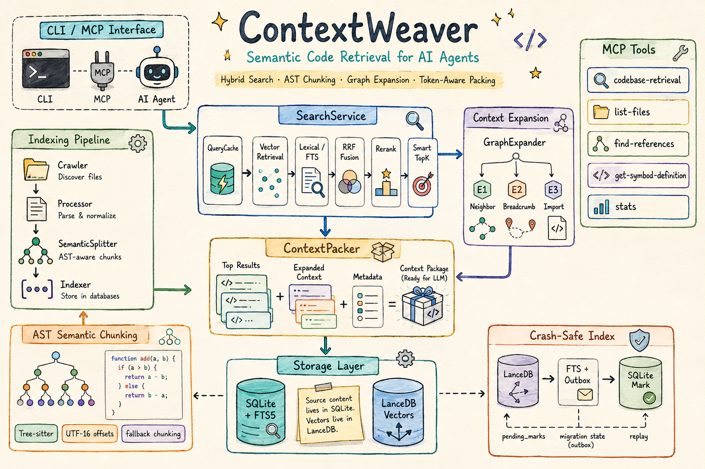
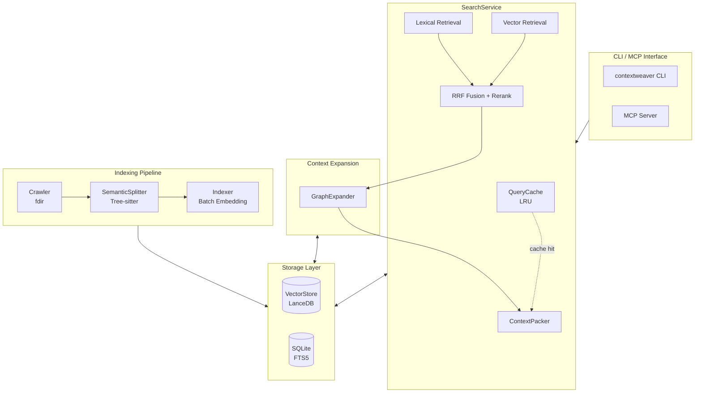

# ContextWeaver

<p align="center">
  <strong>🧵 为 AI Agent 精心编织的代码库上下文引擎</strong>
</p>

<p align="center">
  <em>Semantic Code Retrieval for AI Agents — Hybrid Search • Graph Expansion • Token-Aware Packing</em>
</p>

<p align="center">
  <strong>简体中文</strong> ·
  <a href="README.md">English</a>
</p>

---

**ContextWeaver** 是一个专为 AI 代码助手设计的语义检索引擎，采用混合搜索（向量 + 词法）、智能上下文扩展和 Token 感知打包策略，为 LLM 提供精准、相关且上下文完整的代码片段。

<p align="center">
  
</p>

## ✨ 核心特性

### 🔍 混合检索引擎
- **向量召回 (Vector Retrieval)**：基于语义相似度的深度理解
- **词法召回 (Lexical/FTS)**：精确匹配函数名、类名等技术术语
- **RRF 融合 (Reciprocal Rank Fusion)**：智能融合多路召回结果

### 🧠 AST 语义分片
- **Tree-sitter 解析**：支持 TypeScript、JavaScript、Python、Go、Java、Rust、C、C++、C# 等语言
- **Dual-Text 策略**：`displayCode` 用于展示，`vectorText` 用于 Embedding
- **Gap-Aware 合并**：智能处理代码间隙，保持语义完整性
- **Breadcrumb 注入**：向量文本包含层级路径，提升检索召回率
- **UTF-16 字符域归一**：在写入 metadata 前用 `SourceAdapter.toCharOffset` 统一偏移，避免多字节字符切片错位（v1.4.0+）

### 📊 三阶段上下文扩展
- **E1 邻居扩展**：同文件前后相邻 chunks，保证代码块完整性
- **E2 面包屑补全**：同一类/函数下的其他方法，理解整体结构
- **E3 Import 解析**：跨文件依赖追踪（可配置开关）

### 🎯 智能截断策略 (Smart TopK)
- **Anchor & Floor**：动态阈值 + 绝对下限双保险
- **Delta Guard**：防止 Top1 outlier 场景的误判
- **Safe Harbor**：前 N 个结果只检查下限，保证基本召回

### 🔌 MCP 原生支持
- **MCP Server 模式**：一键启动 Model Context Protocol 服务端
- **多工具粒度**（v1.5.0+）：除核心语义检索外，新增结构浏览、符号引用、符号定义、统计四类专项工具
- **意图与术语分离**：LLM 友好的 API 设计
- **自动索引**：首次查询自动触发索引，增量更新透明无感

### ⚡ 查询缓存与文件监听 (v1.5.0+)
- **查询缓存 (QueryCache)**：进程内 per-project LRU 缓存（默认 50 条），命中后跳过向量召回/Rerank/扩展全流程
- **缓存自动失效**：缓存键由 `归一化查询 + projectId + 索引版本 + 搜索配置指纹` 组成，索引更新或配置变更后自动失效，不会返回陈旧结果
- **Watch 模式**：`contextweaver watch` 监听文件系统变化并自动触发增量索引，带防抖（默认 500ms）与扫描去重（避免并发扫描）

### 📈 统计与可观测 (v1.5.0+)
- **三类指标**：索引过程、搜索质量/行为、健康/一致性
- **双出口**：`contextweaver stats` CLI（支持 `--json`）+ MCP `stats` 工具
- **一致性诊断**：自动检测迁移状态异常、`pending_marks` 积压、向量行缺失等问题并给出修复建议

### 🛡️ Crash-Safe 数据架构 (v1.4.0+)
- **正文唯一源**：LanceDB 仅存向量与定位元数据，正文回查 `files.content`，索引体积降低 30-50%
- **跨库事务补偿**：LanceDB → FTS+outbox → SQLite mark 三阶段写入，任一失败自动回滚或重放
- **迁移状态机**：`pending/done/aborted` 三态持久化，崩溃恢复自动重建
- **跨进程互斥**：advisory lock 防止 MCP server 与 CLI 并发触发 LanceDB 迁移
- **chunk_id 去重**：写入前预删除，防止 retry 场景产生重复行

## 📦 快速开始

### 环境要求

- Node.js >= 20
- pnpm (推荐) 或 npm

### 安装

```bash
# 全局安装
npm install -g @chiway/contextweaver

# 或使用 pnpm
pnpm add -g @chiway/contextweaver
```

### 初始化配置

```bash
# 初始化配置文件（创建 ~/.contextweaver/.env）
contextweaver init
# 或简写
cw init
```

编辑 `~/.contextweaver/.env`，填入你的 API Key：

```bash
# Embedding API 配置（必需）
EMBEDDINGS_API_KEY=your-api-key-here
EMBEDDINGS_BASE_URL=https://api.siliconflow.cn/v1/embeddings
EMBEDDINGS_MODEL=BAAI/bge-m3
EMBEDDINGS_MAX_CONCURRENCY=10
EMBEDDINGS_DIMENSIONS=1024

# Reranker 配置（必需）
RERANK_API_KEY=your-api-key-here
RERANK_BASE_URL=https://api.siliconflow.cn/v1/rerank
RERANK_MODEL=BAAI/bge-reranker-v2-m3
RERANK_TOP_N=20

# 搜索参数（可选，覆盖内置默认值）
CW_SEARCH_WVEC=0.6
CW_SEARCH_WLEX=0.4
CW_SEARCH_RERANK_TOP_N=10
CW_SEARCH_MAX_TOTAL_CHARS=48000
CW_SEARCH_VECTOR_TOP_K=80
CW_SEARCH_SMART_MAX_K=8
CW_SEARCH_IMPORT_FILES_PER_SEED=3

# 忽略模式（可选，逗号分隔）
# IGNORE_PATTERNS=.venv,node_modules
```

### 索引代码库

```bash
# 在代码库根目录执行
contextweaver index

# 指定路径
contextweaver index /path/to/your/project

# 强制重新索引
contextweaver index --force
```

### 监听模式（v1.5.0+）

```bash
# 监听文件变化并自动增量索引（按 Ctrl+C 停止）
contextweaver watch

# 指定路径与防抖时间（毫秒）
contextweaver watch /path/to/project --debounce 800
```

`watch` 会在启动时先执行一次全量增量扫描，随后监听文件系统事件；变更触发防抖窗口内的去重扫描，已被忽略规则过滤的路径不会触发扫描。

### 本地搜索

```bash
# 语义搜索
cw search --information-request "用户认证流程是如何实现的？"

# 带精确术语
cw search --information-request "数据库连接逻辑" --technical-terms "DatabasePool,Connection"
```

### 结构浏览与符号查找（v1.5.0+）

以下命令是 MCP 工具的 CLI 镜像，零 Embedding API 成本：

```bash
# 列出已索引文件（支持 glob / 语言 / 数量过滤）
contextweaver list-files --glob "src/**/*.ts" --language typescript --max-results 100

# 查看符号定义
contextweaver definition SearchService --hint-path src/search

# 查看符号引用
contextweaver references handleStats --exclude-definition
```

### 统计（v1.5.0+）

```bash
# 人类可读的统计报告
contextweaver stats

# JSON 输出（便于脚本消费）
contextweaver stats --json

# 指定项目路径
contextweaver stats --path /path/to/project
```

### 启动 MCP 服务器

```bash
# 启动 MCP 服务端（供 Claude 等 AI 助手使用）
contextweaver mcp
```

### 索引管理 (v1.4.0+)

```bash
# 查看 LanceDB 迁移状态
contextweaver migrate

# 解除 aborted 状态：清空 LanceDB 并触发全量重建
# 触发时机：抽样校验失败后 Indexer 拒绝写入；运行此命令后再次 index 即可
contextweaver migrate --reset

# 指定项目路径
contextweaver migrate --path /path/to/project
```

## 🔧 MCP 集成配置

### Claude Desktop 配置

在 Claude Desktop 的配置文件中添加：

```json
{
  "mcpServers": {
    "contextweaver": {
      "command": "contextweaver",
      "args": ["mcp"]
    }
  }
}
```

### MCP 工具一览（v1.5.0+）

ContextWeaver 提供 5 个 MCP 工具，遵循「语义检索为主、结构浏览为辅」的分层设计：

| 工具 | 用途 | Embedding 成本 |
|------|------|---------------|
| `codebase-retrieval` | **主力工具**：混合语义 + 精确匹配检索 | 有 |
| `list-files` | 列出已索引文件结构（路径/语言/大小） | 无 |
| `find-references` | 查找符号的启发式文本引用 | 无 |
| `get-symbol-definition` | 查找符号的疑似定义块 | 无 |
| `stats` | 索引/搜索/健康统计 | 无 |

#### `codebase-retrieval` 参数说明

| 参数 | 类型 | 必需 | 描述 |
|------|------|------|------|
| `repo_path` | string | ✅ | 代码库根目录的绝对路径 |
| `information_request` | string | ✅ | 自然语言形式的语义意图描述 |
| `technical_terms` | string[] | ❌ | 精确技术术语（类名、函数名等） |
| `mode` | string | ❌ | 检索模式：`quick`、`balanced` 或 `deep` |
| `include_globs` | string[] | ❌ | 检索后应用的文件 glob 白名单 |
| `exclude_globs` | string[] | ❌ | 检索后应用的文件 glob 黑名单 |
| `language` | string[] | ❌ | 检索后应用的语言白名单 |
| `max_total_chars` | number | ❌ | 单次调用的输出字符预算 |
| `max_files` | number | ❌ | 打包后返回的最大文件数 |
| `max_segments_per_file` | number | ❌ | 每个文件返回的最大非连续片段数 |
| `return_debug` | boolean | ❌ | 在结构化输出中包含调试元数据 |
| `low_confidence_behavior` | string | ❌ | 低置信命中处理：`return_top1`、`return_empty` 或 `return_with_warning` |
| `output_format` | string | ❌ | 响应格式：`markdown`、`json` 或 `both` |

#### `list-files` 参数说明

| 参数 | 类型 | 必需 | 描述 |
|------|------|------|------|
| `repo_path` | string | ✅ | 代码库根目录的绝对路径 |
| `glob` | string | ❌ | 路径 glob 过滤 |
| `language` | string | ❌ | 语言过滤（匹配 `files.language`） |
| `max_results` | number | ❌ | 最大返回数量（默认 200） |

#### `find-references` 参数说明

| 参数 | 类型 | 必需 | 描述 |
|------|------|------|------|
| `repo_path` | string | ✅ | 代码库根目录的绝对路径 |
| `symbol` | string | ✅ | 精确符号名 |
| `exclude_definition` | boolean | ❌ | 排除面包屑尾部匹配符号名的 chunk |
| `max_results` | number | ❌ | 最大返回数量（默认 50） |

#### `get-symbol-definition` 参数说明

| 参数 | 类型 | 必需 | 描述 |
|------|------|------|------|
| `repo_path` | string | ✅ | 代码库根目录的绝对路径 |
| `symbol` | string | ✅ | 要解析的精确符号名 |
| `hint_path` | string | ❌ | 用于同名定义消歧的偏好路径 |
| `max_results` | number | ❌ | 最大返回数量（默认 3） |

> **说明**：`find-references` 与 `get-symbol-definition` 是基于已索引 chunk 的启发式文本检索，并非编译器级精确导航。穷尽式原始文本匹配请在 MCP 之外使用 `grep`。

#### 设计理念

- **意图与术语分离**：`information_request` 描述「做什么」，`technical_terms` 过滤「叫什么」
- **同文件上下文优先**：默认提供同文件上下文，跨文件探索由 Agent 自主发起
- **回归代理本能**：工具只负责定位，跨文件探索由 Agent 按需触发

## 🏗️ 架构设计



### 核心模块说明

| 模块 | 职责 |
|------|------|
| **SearchService** | 混合搜索核心，协调向量/词法召回、RRF 融合、Rerank 精排，集成 QueryCache |
| **QueryCache** | per-project 进程内 LRU 缓存（v1.5.0+），命中后跳过整条检索流水线 |
| **GraphExpander** | 上下文扩展器，执行 E1/E2/E3 三阶段扩展策略 |
| **ContextPacker** | 上下文打包器，负责段落合并和 Token 预算控制 |
| **ChunkContentLoader** | 按 `(path, start_index, end_index)` 从 `files.content` 批量切片（v1.4.0+） |
| **VectorStore** | LanceDB 适配层，仅暴露纯 vector 操作 |
| **Database (SQLite)** | 元数据存储 + FTS5 全文索引 + 统计计数器，schema_version=3 |
| **Bootstrap** | 跨库初始化协调器：pending_marks 重放 + LanceDB schema 迁移（v1.4.0+） |
| **SemanticSplitter** | AST 语义分片器，基于 Tree-sitter 解析，写入时统一到 UTF-16 字符域 |
| **Watcher** | 文件监听协调器（v1.5.0+），防抖 + 扫描去重 + 忽略过滤 |
| **Stats** | 统计聚合层（v1.5.0+），组合索引/搜索/健康三类指标 |

### 数据架构 (v1.4.0+)

```
~/.contextweaver/<projectId>/
├── index.db                 # SQLite
│   ├── files                # 文件元数据 + 完整正文（content 列，文本切片唯一来源）
│   ├── files_fts            # 外部内容表，倒排索引指向 files
│   ├── chunks_fts           # chunk 级倒排索引，per-file 整体替换
│   ├── metadata             # schema_version / lancedb_migration_state / lock
│   ├── stats                # 索引/搜索累计计数器（v1.5.0+）
│   └── pending_marks        # outbox：vector_index_hash 标记失败时启动重放
└── vectors.lance/           # LanceDB chunks 表（仅向量 + 定位元数据，不存正文）
```

**关键不变量**：
- 正文唯一源是 `files.content`；`ChunkContentLoader` 用 `start_index/end_index` 切片（与 `displayCode` 同源）
- 所有 LanceDB 偏移字段都在 UTF-16 字符域，多字节文件不会切错
- 跨库写入顺序：LanceDB → (FTS + outbox 单事务) → SQLite mark + 清 outbox
- LanceDB 迁移状态 `pending/done/aborted` 持久化，跨进程用 advisory lock 互斥
- 查询缓存键绑定索引版本与搜索配置指纹，索引或配置变更即失效

## 📁 项目结构

```
contextweaver/
├── src/
│   ├── index.ts              # CLI 入口（init / index / watch / search / mcp / migrate / stats）
│   ├── config.ts             # 配置管理（环境变量）
│   ├── defaultEnv.ts         # 默认 .env 模板
│   ├── cli/
│   │   └── mirrorCommands.ts # MCP 工具的 CLI 镜像（list-files / definition / references）
│   ├── api/                  # 外部 API 封装
│   │   ├── embedding.ts      # Embedding API
│   │   └── reranker.ts       # Reranker API
│   ├── chunking/             # 语义分片
│   │   ├── SemanticSplitter.ts   # AST 语义分片器
│   │   ├── SourceAdapter.ts      # 源码适配器（UTF-16/UTF-8 域归一）
│   │   ├── LanguageSpec.ts       # 语言规范定义
│   │   ├── ParserPool.ts         # Tree-sitter 解析器池
│   │   └── types.ts              # 分片类型定义
│   ├── scanner/              # 文件扫描
│   │   ├── index.ts          # 扫描编排
│   │   ├── crawler.ts        # 文件系统遍历
│   │   ├── processor.ts      # 文件处理
│   │   ├── watcher.ts        # 文件监听协调器（v1.5.0+）
│   │   ├── filter.ts         # 过滤规则
│   │   ├── hash.ts           # 文件 hash
│   │   └── language.ts       # 语言识别
│   ├── indexer/              # 索引器
│   │   └── index.ts          # 三阶段事务（LanceDB → FTS+outbox → SQLite mark）
│   ├── vectorStore/          # 向量存储
│   │   └── index.ts          # LanceDB 适配层（纯 vector 操作）
│   ├── db/                   # 数据库
│   │   ├── index.ts          # SQLite + FTS5 + pending_marks + 迁移状态机 + 统计计数器
│   │   └── bootstrap.ts      # 跨库初始化协调（v1.4.0+）
│   ├── search/               # 搜索服务
│   │   ├── SearchService.ts      # 核心搜索服务（集成缓存）
│   │   ├── QueryCache.ts         # per-project LRU 查询缓存（v1.5.0+）
│   │   ├── GraphExpander.ts      # 上下文扩展器
│   │   ├── ContextPacker.ts      # 上下文打包器
│   │   ├── ChunkContentLoader.ts # 按 (path, start_index, end_index) 切片（v1.4.0+）
│   │   ├── fts.ts                # 全文搜索（per-file 整体替换）
│   │   ├── config.ts             # 搜索默认配置 + 取值边界
│   │   ├── loadConfig.ts         # 环境变量覆盖 + 配置指纹（v1.5.0+）
│   │   ├── types.ts              # 类型定义
│   │   ├── utils.ts              # token overlap 评分
│   │   └── resolvers/            # 多语言 Import 解析器
│   │       ├── JsTsResolver.ts
│   │       ├── PythonResolver.ts
│   │       ├── GoResolver.ts
│   │       ├── JavaResolver.ts
│   │       ├── RustResolver.ts
│   │       ├── CppResolver.ts
│   │       └── CSharpResolver.ts
│   ├── stats/                # 统计聚合层（v1.5.0+）
│   │   └── index.ts          # 索引/搜索/健康三类指标聚合与渲染
│   ├── mcp/                  # MCP 服务端
│   │   ├── server.ts         # MCP 服务器实现（注册 5 个工具）
│   │   ├── main.ts           # MCP 入口
│   │   └── tools/
│   │       ├── index.ts                 # 工具注册中心
│   │       ├── shared.ts                # 工具共享逻辑
│   │       ├── codebaseRetrieval.ts     # 代码检索工具
│   │       ├── listFiles.ts             # 文件结构浏览（v1.5.0+）
│   │       ├── findReferences.ts        # 符号引用查找（v1.5.0+）
│   │       ├── getSymbolDefinition.ts   # 符号定义查找（v1.5.0+）
│   │       └── stats.ts                 # 统计工具（v1.5.0+）
│   └── utils/                # 工具函数
│       ├── logger.ts         # 日志系统
│       ├── encoding.ts       # 编码检测
│       └── lock.ts           # 文件锁
├── tests/                    # 单测 + 集成测试（28 个测试文件，156 个测试用例）
│   ├── chunking/             # SourceAdapter / 分片
│   ├── cli/                  # mirrorCommands
│   ├── db/                   # 迁移、outbox、advisory lock、index-version
│   ├── indexer/              # 事务补偿、GC、aborted 守卫
│   ├── integration/          # 真实 LanceDB 端到端
│   ├── mcp/                  # list-files / find-references / get-symbol-definition / shared / 工具注册
│   ├── scanner/              # watcher / index-version
│   ├── search/               # FTS、ChunkContentLoader、Packer、缓存、loadConfig
│   ├── stats/                # 统计聚合
│   └── vectorStore/          # chunk_id 去重、抽样校验
├── package.json
└── tsconfig.json
```

## ⚙️ 配置详解

### 环境变量

| 变量名 | 必需 | 默认值 | 描述 |
|--------|------|--------|------|
| `EMBEDDINGS_API_KEY` | ✅ | - | Embedding API 密钥 |
| `EMBEDDINGS_BASE_URL` | ✅ | - | Embedding API 地址 |
| `EMBEDDINGS_MODEL` | ✅ | - | Embedding 模型名称 |
| `EMBEDDINGS_MAX_CONCURRENCY` | ❌ | 10 | Embedding 并发数 |
| `EMBEDDINGS_DIMENSIONS` | ❌ | 1024 | 向量维度 |
| `RERANK_API_KEY` | ✅ | - | Reranker API 密钥 |
| `RERANK_BASE_URL` | ✅ | - | Reranker API 地址 |
| `RERANK_MODEL` | ✅ | - | Reranker 模型名称 |
| `RERANK_TOP_N` | ❌ | 20 | Rerank 返回数量 |
| `IGNORE_PATTERNS` | ❌ | - | 额外忽略模式 |

### 搜索参数环境变量覆盖（v1.5.0+）

以下环境变量可覆盖内置默认值；超出取值边界时会被自动钳制到合法区间。`wVec`/`wLex` 只设其一时，另一个自动取 `1 - x`。

| 变量名 | 默认值 | 取值边界 | 描述 |
|--------|--------|----------|------|
| `CW_SEARCH_WVEC` | 0.6 | 0–1 | 向量权重（融合阶段） |
| `CW_SEARCH_WLEX` | 0.4 | 0–1 | 词法权重（与 `wVec` 互补） |
| `CW_SEARCH_RERANK_TOP_N` | 10 | 5–20 | Rerank 后保留数量 |
| `CW_SEARCH_MAX_TOTAL_CHARS` | 48000 | 20000–80000 | Token 预算（以字符计，约 12k tokens） |
| `CW_SEARCH_VECTOR_TOP_K` | 80 | 40–200 | 向量召回候选数 |
| `CW_SEARCH_SMART_MAX_K` | 8 | 5–15 | Smart TopK 硬上限 |
| `CW_SEARCH_IMPORT_FILES_PER_SEED` | 3 | 0–5 | E3 每 seed 解析的导入文件数（0 关闭跨文件扩展） |

### 搜索配置参数（内置默认值）

```typescript
interface SearchConfig {
  // === 召回阶段 ===
  vectorTopK: number;        // 向量召回候选数（默认 80）
  vectorTopM: number;        // 去重后保留的向量数（默认 60）
  ftsTopKFiles: number;      // FTS 召回文件数（默认 20）
  lexChunksPerFile: number;  // 每文件词法 chunks 数（默认 2）
  lexTotalChunks: number;    // 词法总 chunks 数（默认 40）

  // === 融合阶段 ===
  rrfK0: number;             // RRF 平滑常数（默认 20）
  wVec: number;              // 向量权重（默认 0.6）
  wLex: number;              // 词法权重（默认 0.4）
  fusedTopM: number;         // 融合后送 rerank 数量（默认 60）

  // === Rerank ===
  rerankTopN: number;        // Rerank 后保留数量（默认 10）
  maxRerankChars: number;    // Rerank 文本最大字符数（默认 1000）
  maxBreadcrumbChars: number;// 面包屑上下文最大字符数（默认 250）
  headRatio: number;         // 截断时 head/tail 比例（默认 0.67）

  // === 扩展策略 ===
  neighborHops: number;      // E1 邻居跳数（默认 2）
  breadcrumbExpandLimit: number;  // E2 面包屑补全数（默认 3）
  importFilesPerSeed: number;     // E3 每 seed 导入文件数（默认 3）
  chunksPerImportFile: number;    // E3 每导入文件 chunks（默认 3）

  // === ContextPacker ===
  maxSegmentsPerFile: number;     // 每文件最大非连续段数（默认 3）
  maxTotalChars: number;          // Token 预算（字符，默认 48000）

  // === Smart TopK ===
  enableSmartTopK: boolean;       // 启用智能截断（默认 true）
  smartTopScoreRatio: number;     // 动态阈值比例（默认 0.5）
  smartTopScoreDeltaAbs: number;  // 相对 Top1 最大绝对降幅（默认 0.25）
  smartMinScore: number;          // 绝对下限（默认 0.25）
  smartMinK: number;              // Safe Harbor 数量（默认 2）
  smartMaxK: number;              // 硬上限（默认 8）
}
```

## 🌍 多语言支持

ContextWeaver 通过 Tree-sitter 原生支持以下编程语言的 AST 解析：

| 语言 | AST 解析 | Import 解析 | 文件扩展名 |
|------|----------|-------------|-----------|
| TypeScript | ✅ | ✅ | `.ts`, `.tsx` |
| JavaScript | ✅ | ✅ | `.js`, `.jsx`, `.mjs`, `.cjs` |
| Python | ✅ | ✅ | `.py` |
| Go | ✅ | ✅ | `.go` |
| Java | ✅ | ✅ | `.java` |
| Rust | ✅ | ✅ | `.rs` |
| C | ✅ | ✅ | `.c`, `.h` |
| C++ | ✅ | ✅ | `.cpp`, `.cc`, `.cxx`, `.hpp` |
| C# | ✅ | ✅ | `.cs` |

其他语言会采用基于行的 Fallback 分片策略，仍可正常索引和搜索。

## 🔄 工作流程

### 索引流程

```
0. Bootstrap   → pending_marks 重放 + LanceDB schema 迁移（首次启动）
1. Crawler     → 遍历文件系统，过滤忽略项
2. Processor   → 读取文件内容，计算 hash
3. Splitter    → AST 解析，语义分片（偏移归一到 UTF-16 字符域）
4. Indexer     → 批量 Embedding
5. 阶段 4-6 伪事务：
   ├─ LanceDB 写入（预删 (path, hash) 防重复 → add → 清旧版本）
   ├─ FTS + outbox 单 SQLite 事务（失败回滚 LanceDB）
   └─ SQLite mark + 清 outbox 单事务（失败时 outbox 保留，下次启动 replay）
6. 末尾 GC     → 清理 LanceDB 孤儿 chunks（time budget 5s）
```

### 搜索流程

```
1. Query Parse     → 解析查询，分离语义和术语
2. Cache Lookup    → 命中则直接返回（v1.5.0+，缓存键含索引版本 + 配置指纹）
3. Hybrid Recall   → 向量 + 词法双路召回
4. RRF Fusion      → Reciprocal Rank Fusion 融合
5. Rerank          → 交叉编码器精排
6. Smart Cutoff    → 智能分数截断
7. Graph Expand    → 邻居/面包屑/导入扩展
8. Context Pack    → 段落合并，Token 预算
9. Cache Store     → 写入缓存（v1.5.0+）
10. Format Output  → 格式化返回给 LLM
```

## 📊 性能特性

- **查询缓存**：重复查询命中 LRU 缓存，跳过召回/Rerank/扩展全流程（v1.5.0+）
- **增量索引**：只处理变更文件，二次索引速度提升 10x+
- **批量 Embedding**：自适应批次大小，支持并发控制
- **速率限制恢复**：429 错误时自动退避，渐进恢复
- **连接池复用**：Tree-sitter 解析器池化复用
- **文件索引缓存**：GraphExpander 文件路径索引 lazy load
- **零成本元数据工具**：`list-files`/`find-references`/`get-symbol-definition` 不调用 Embedding API（v1.5.0+）

## 📈 统计与可观测 (v1.5.0+)

`contextweaver stats` 输出三个分区：

- **索引过程**：累计索引运行次数、上次索引时间、上次结果快照（新增/修改/删除/未变/跳过/错误 + 向量索引明细）
- **搜索质量/行为**：累计查询次数、缓存命中率、实际计算次数，以及各阶段平均耗时（retrieve / rerank / expand / pack）与平均召回 seed 数
- **健康/一致性**：文件数与正文总量、LanceDB 向量行数、embedding 维度、索引版本、迁移状态、`pending_marks`、语言占比

当检测到迁移状态异常、`pending_marks` 积压或向量行缺失时，报告底部会输出**诊断告警**及对应修复命令。`--json` 输出结构对应 `StatsReport`，便于脚本与监控系统消费。

## 🐛 日志与调试

日志文件位置：`~/.contextweaver/logs/app.YYYY-MM-DD.log`

设置日志级别：

```bash
# 开启 debug 日志
LOG_LEVEL=debug contextweaver search --information-request "..."
```

## 🚨 故障排查 (v1.4.0+)

### LanceDB 迁移卡死 (`aborted` 状态)

**现象**：`contextweaver index` 报错 "LanceDB 处于 aborted 状态，拒绝写入以防止 schema 污染"。

**原因**：v1.4.0 升级时 LanceDB 旧索引中的 `display_code` 与当前 `files.content` 抽样差异 > 1%（通常发生在 chunk 偏移用 UTF-8 字节域旧索引上）。

**解决**：
```bash
contextweaver migrate --reset   # 清空 LanceDB chunks 表 + 重置状态为 done
contextweaver index             # 全量重建（新 schema）
```

也可先运行 `contextweaver stats` 查看诊断告警，确认当前迁移状态与 `pending_marks` 积压情况。

### 跨进程迁移竞争

如果 MCP server 长驻 + 另一终端跑 `contextweaver index`，两进程会争抢迁移。v1.4.0 引入 10 分钟僵尸阈值的 advisory lock，自动让一个进程跳过迁移、另一个完成。

如锁卡住（process kill -9 后），可手动清理：
```bash
sqlite3 ~/.contextweaver/<projectId>/index.db \
  "DELETE FROM metadata WHERE key = 'lancedb_migration_lock';"
```

### 重复 embedding 浪费

v1.4.0 已通过 `pending_marks` outbox 机制解决：FTS 写入成功但 vector_index_hash 标记失败时，下次启动自动 replay，不会触发重复 embedding。

### 搜索结果未反映最新改动

确认增量索引已执行（或开启 `contextweaver watch` 自动增量）。查询缓存键绑定索引版本，索引更新后旧缓存自动失效，无需手动清理。

## 📄 开源协议

本项目采用 MIT 许可证。

## 🙏 致谢

- [Tree-sitter](https://tree-sitter.github.io/tree-sitter/) - 高性能语法解析
- [LanceDB](https://lancedb.com/) - 嵌入式向量数据库
- [MCP](https://modelcontextprotocol.io/) - Model Context Protocol
- [Source](https://github.com/hsingjui/ContextWeaver) - 源仓库

---

<p align="center">
  <sub>Made with ❤️ for AI-assisted coding</sub>
</p>
